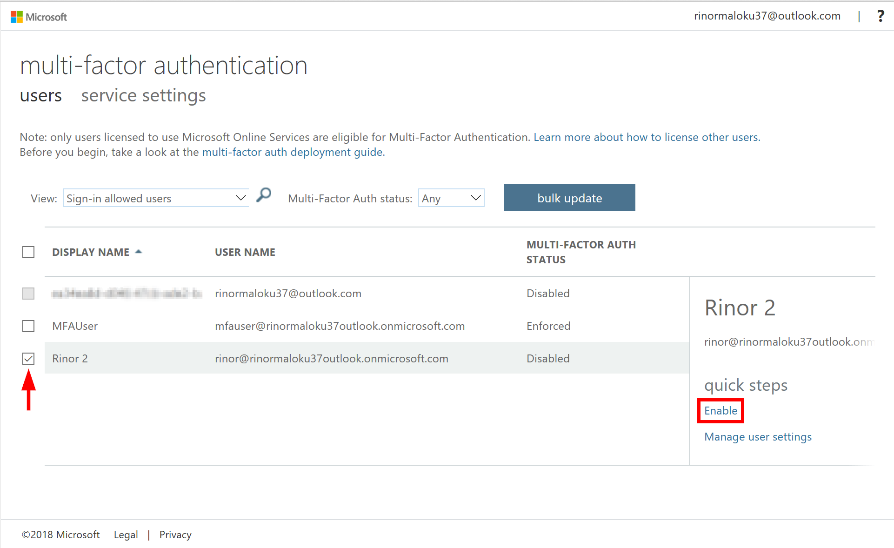

# MFA CSV Uploader

A sample ASP.NET Core MVC project on how to:
  1. Enable MFA Authentication using Azure MFA Provider 
  2. Upload CSV files and insert those to a SQL Server Database.

## Getting Started
To start the project we need to replace the placeholder values in the file appsettings.json.

#### Long way
1. To replace [DOMAIN e.g. contoso.onmicrosoft.com] navigate to Azure Active Directory > Overview and you will find your domain in the format *.onmicrosoft.com. Your domain includes onmicrosoft.com.
2. To replace [TENANT_ID] navigate to Azure Active Directory > Properties and Copy the Directory ID. (That's your Tenant ID)
3. To get a [CLIENT_ID] you need to create a new Web APP / API App registration in your Active Directory. The Home Page should be the location where you will start your application e.g. https://localhost:44373/. Grant this app two Delegated Permissions: 1. Read directory data and 2. Sign in and read user profile. Don't forget beside saving you need to Click GRANT PERMISSIONS.
4. Create a Azure SQL Server and Database get the connection string and replace [CONNECTION_STRING].

#### Short way

1. Create a new project ASP NET Core Web Application and Select the Model View Controller template, click Change Authentication and select Work / School account. Copy the generated values from the new projects appsettings.json to this one.
2. Create a Azure SQL Server and Database get the connection string and replace [CONNECTION_STRING].

## Info

This project enables file upload and Azure Active Directory Authentication. If you didn't enable MFA for the specified user then he can login without Multi-Factor Authentication.

## Enable Multi-Factor Authentication
1. Navigate to Azure Active Directory > Providers, add a new provider.
2. Go back to Azure Active Directory, and navigate to All Users > Multi-Factor Authentication.
3. Select the users you want to turn MFA on for.

